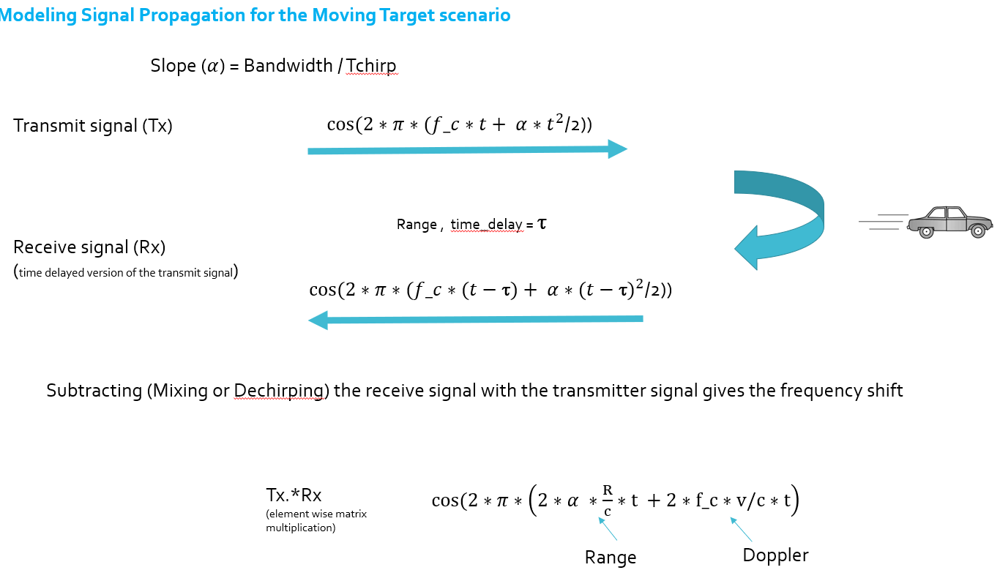
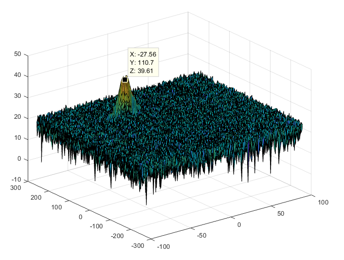
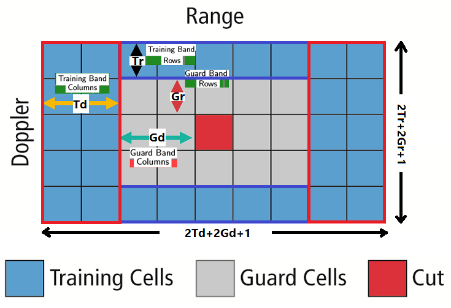
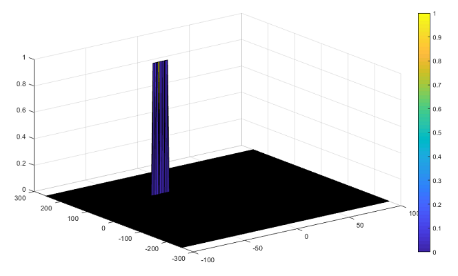

# **Radar Target Generation and Detection Project**

## Project goal
Simulation of the detection process of a Moving Target using the Frequency-Modulated Continuous-Wave (FMCW) Radar technology. A constant velocity Target is generated and a two-dimensional Fast Fourier Transform (2D FFT) approach is used for Target information extraction.

## Project steps


### 2D CFAR implementation steps 
1. Radar Design Specifications

    |Frequency|77 [GHz]|
    |-----------|--------|
    |Range Resolution `d_res`|1 [m]|
    |Max Range `R_max`|200 [m]|
    |Max Velocity `v_max`|70 [m/s]|
    |Velocity Resolution `v_res`|3 [m/s]|

2. FMCW Configuration

    |Variable|Value|
    |-----------|--------|
    |Bandwidth `B_sweep`|1.5*10^8 [Hz]|
    |Sweep time `T_chirp`|7.3*10^-6 [s]|
    |FMCW chirp signal slope `alpha`|2.04*10^13 [1/s^2]|

3. Moving Target Generation
    Target is following constant velocity motion model. Updated Range of the Target for each time stamp _(i)_ is `r_t(i) = R + v*t(i)`

4. Signal Propagation
    _Beat signal_ is the product of the _Transmitted signal_ and _Received signal_. _Received signal_ is a time delayed of the _Transmitted signal_ by delay time τ. 



5. Range/Doppler FFT
    Applying One-dimensional Fast Fourier Transform (FFT) algorithm on _Beat Signal_ to extract information of Target Range, while Two-dimentional FFT extracts Range (_y-axis)_ and Doppler/Velocity (_x-axis_) information surrounded by **Random noise**.


    |Parameter|Ground truth value|Measured value|
    |-----------|--------|--------|
    |Range `R` [m]|110 |110.7|
    |Velocity `v` [m/s]|-30 |-27.56|

6. CFAR Detection
    Used to suppress the noise and separate the target signal by averaging noise in the Training cells, then offsetting the averaged value to obtain a real Target threshold.

    **CFAR Hyperparameters**
    Added _offset_ of 15
    |Cells Type|Dimension|No. of cells|
    |-----------|--------|--------|
    |Training Cells|Range `Tr`|10|
    |              |Doppler `Td`|8|
    |Guard Cells|Range `Gr`|6|
    |               |Doppler `Gd`|6|
    

    Training cells are divided into 4 sections where i: _Range/rows index_ and j: _Doppler/columns index_.
    
    |Section|Range Dimension boundries|Doppler Dimension boundries|size [cells]|
    |-----------|--------|--------|--------|
    |Left Section|i to i+(2Tr+2Gr)|j to (j+Td-1)|33 x 6|
    |Right Section|i to i+(2Tr+2Gr)|j+(Td+2Gd+1) to j+(2Td+2Gd)|33 x 6|
    |Upper Section| i to (i+Tr-1) | (j+Td) to (j+Td+2Gd)|10 x 7|
    |Lower Section|i+(Tr+2Gr+1) to i+(2Tr+2Gr)|(j+Td) to (j+Td+2Gd)|10 x 7|

    Cells at the edges are non-thresholded cells (cannot be suppressed from the noise using the regular approach due to CFAR dimensionality limitation), so they are manually equated to zero.
    
    ```
    RDM(1:Nr/2, 1:Td+Gd) = 0;
    RDM(1:Nr/2, Nd-(Td+Gd):Nd) = 0;
    RDM(1:Tr+Gr, 1:Nd) = 0;
    RDM(Nr/2-(Tr+Gr):Nr/2, 1:Nd) = 0; 
    ```
    


## Basic Build Instructions

- Install _MATLAB_
- Clone this repo. 
- Switch MATLAB current folder (default path) to the project main path.
- Run _Radar_Target_Generation_and_Detection.m_ script in MATLAB environment.
